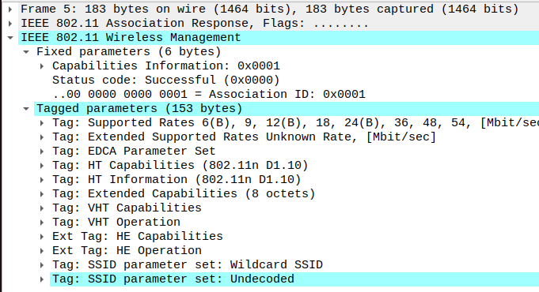
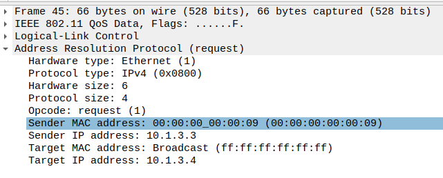

# Laboratory 5: Analysis of Wireshark Network Activity Traces

## 1. Network Setup and Key Simulation Events
The simulation setup consists of:
- **Point-to-Point (P2P)** connection between two nodes with specific data rate and delay attributes.
- **CSMA and Wi-Fi Networks** connected to various nodes.
- **UDP Echo Server and Client** configured to send and receive packets with defined intervals.

## 2. Analysis

### 2.1 Initial UDP Handshake and Packet Exchanges

The UDP Echo Client initiates communication with the Echo Server on port 9. This first packet confirms that the client is attempting to connect to the server, setting up the communication session.

- **Source IP**: `10.1.3.3` (UDP Echo Client)
- **Destination IP**: `10.1.2.4` (UDP Echo Server)
- **Source Port**: An ephemeral port (`49153`), dynamically assigned by the client
- **Destination Port**: Port `9`, specified in the server setup

This packet marks the start of data flow between the client and server, indicating that the network and applications are correctly configured to communicate.

```cpp
UdpEchoServerHelper echoServer(9);
ApplicationContainer serverApps = echoServer.Install(csmaNodes.Get(nCsma));
serverApps.Start(Seconds(1.0));
serverApps.Stop(Seconds(10.0));

UdpEchoClientHelper echoClient(csmaInterfaces.GetAddress(nCsma), 9);
echoClient.SetAttribute("MaxPackets", UintegerValue(10));
echoClient.SetAttribute("Interval", TimeValue(Seconds(1.0)));
echoClient.SetAttribute("PacketSize", UintegerValue(1024));
```
The screenshot below shows the initial UDP handshake packet between the client and server on port 9, demonstrating the start of the communication process.
  

### 2.2 Mobility Events, Position Updates, and 802.11 Management Frames

As nodes move within the network, their positions change periodically, affecting network connectivity and packet transmission. These movements are logged in the simulation and observed in Wireshark as fluctuations in packet timing and intervals. The mobile node (`10.1.3.3`) communicates with other nodes, and its movement introduces variation in packet intervals, reflecting connectivity challenges due to node mobility.

To maintain connectivity in a Wi-Fi environment, 802.11 management frames include:

- **Beacon Frames**
  - 
  - ***SSID***: `ns-3-ssid` – Identifies the network, allowing the mobile node to recognize it.
  - ***Beacon Interval***: 0.102400 seconds – Frequency of beacon broadcasts
  - ***Supported Rates***: 6, 9, 12, 18, 24, 36, 48, 54 Mbps – Available data rates for optimizing connection speed.
  - ***Capabilities***: HE, VHT, HT – Support for advanced Wi-Fi standards.
- **Association Requests and Responses**
  - 
  - ***Status Code***: Successful (0x0000) – Confirms the mobile node is allowed to join the network.
  - ***Association ID***: 0x0001 – Unique identifier assigned to the mobile node.
  - ***Supported Rates***: 6 to 54 Mbps – Data rates available for optimized communication.
  - ***Capabilities***: HE, VHT, HT – Support for advanced Wi-Fi standards.
- **Acknowledgment Frames**
- **Malformed Packets**
  - Malformed packets in this simulation could occur due to network mobility and connectivity disruptions
- **ARP requests**
  - 
  - are used to map IP addresses to MAC addresses within the network. ARP request is broadcast to all nodes on the network, asking for the MAC address of the target IP address.
  - **Sender IP Address**: `10.1.3.3` (mobile node)
  - **Target IP Address**: `10.1.3.4`
  - **Broadcast MAC Address**: `ff:ff:ff:ff:ff:ff` (indicating that all nodes on the network should receive and process the request)


These frames illustrate the impact of mobility on connectivity, as the mobile node relies on them to reconnect whenever it moves back into the network's coverage area.

The screenshot below shows the captured 802.11 management frames, including beacon frames, association requests and responses, acknowledgment frames, and malformed packets.


