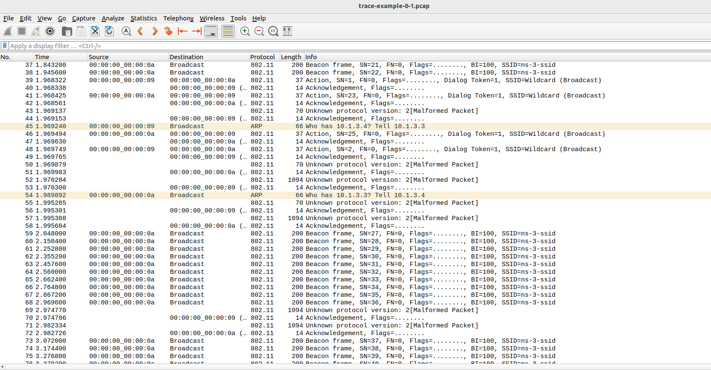

# Laboratory 5: Analysis of Wireshark Network Activity Traces

## 1. Network Setup and Key Simulation Events
The simulation setup consists of:
- **Point-to-Point (P2P)** connection between two nodes with specific data rate and delay attributes.
- **CSMA and Wi-Fi Networks** connected to various nodes.
- **UDP Echo Server and Client** configured to send and receive packets with defined intervals.

## 2. Analysis

### 2.1 Initial UDP Handshake and Packet Exchanges

The UDP Echo Client initiates communication with the Echo Server on port 9. This first packet confirms that the client is attempting to connect to the server, setting up the communication session.

- **Source IP**: `10.1.3.3` (UDP Echo Client)
- **Destination IP**: `10.1.2.4` (UDP Echo Server)
- **Source Port**: An ephemeral port (`49153`), dynamically assigned by the client
- **Destination Port**: Port `9`, specified in the server setup

This packet marks the start of data flow between the client and server, indicating that the network and applications are correctly configured to communicate.

```cpp
UdpEchoServerHelper echoServer(9);
ApplicationContainer serverApps = echoServer.Install(csmaNodes.Get(nCsma));
serverApps.Start(Seconds(1.0));
serverApps.Stop(Seconds(10.0));

UdpEchoClientHelper echoClient(csmaInterfaces.GetAddress(nCsma), 9);
echoClient.SetAttribute("MaxPackets", UintegerValue(10));
echoClient.SetAttribute("Interval", TimeValue(Seconds(1.0)));
echoClient.SetAttribute("PacketSize", UintegerValue(1024));
```
The screenshot below shows the initial UDP handshake packet between the client and server on port 9, demonstrating the start of the communication process.
  


### 2.2 Mobility Events, Position Updates, and 802.11 Management Frames

As nodes move within the network, their positions change periodically, affecting network connectivity and packet transmission. These movements are logged in the simulation and observed in Wireshark as fluctuations in packet timing and intervals. The mobile node (`10.1.3.3`) communicates with other nodes, and its movement introduces variation in packet intervals, reflecting connectivity challenges due to node mobility.

To maintain connectivity in a Wi-Fi environment, 802.11 management frames include for example:

- **Beacon Frame**: Broadcast periodically by the access point (AP) to announce the Wi-Fi network (`ns-3-ssid`). The mobile node detects these beacons to recognize when it is within the AP’s range.
- **Association Request and Response**: When the mobile node comes within range, it sends an association request to join the network, and the AP responds with an association response, granting access. These exchanges may repeat as the mobile node reconnects upon moving back within range.
- **Acknowledgment**: Acknowledgment frames confirm the receipt of management frames.

This process enables the mobile node to maintain a connection to the Wi-Fi network even as it moves, though repeated association requests and responses may signal mobility-related disconnections.

#### Code Snippet
```cpp
mobility.SetPositionAllocator("ns3::GridPositionAllocator",
                              "MinX", DoubleValue(0.0),
                              "MinY", DoubleValue(0.0),
                              "DeltaX", DoubleValue(5.0),
                              "DeltaY", DoubleValue(10.0),
                              "GridWidth", UintegerValue(3),
                              "LayoutType", StringValue("RowFirst"));

mobility.SetMobilityModel("ns3::RandomWalk2dMobilityModel",
                          "Bounds", RectangleValue(Rectangle(-50, 50, -50, 50)));
mobility.Install(wifiStaNodes);
```

The screenshot below captures a beacon frame, an association request, and an association response. We cans see the `ssid` is broadcasted which can be used to identify the network  
  


### 2.3. Packet Queue Management
Queue length changes were observed and captured, showing congestion levels in network queues. When the queue length increases, packets may be held or dropped, depending on the network’s traffic load.
- **Packet Explanation**: These packets reflect the queue's state when managing traffic; a high queue length might lead to packet delays or drops, which can be confirmed by packet retransmissions in Wireshark.
- **Screenshot Placeholder**: 
  

### 2.4. Packet Drops
During high congestion, packets are occasionally dropped from the queue. Wireshark captures these events with details on the specific times and packets affected.
- **Packet Explanation**: Packet drops indicate network congestion. Dropped packets typically require retransmission, affecting overall latency and throughput.
- **Screenshot Placeholder**: 
  

### 2.5. Client-Server Data Exchange
The simulation logs capture packets sent from the client and received by the server, with corresponding acknowledgments. Each packet sent and received in the data exchange can be correlated to a time event in the simulation logs.
- **Packet Explanation**: This section illustrates successful communication between the client and server, indicating stable connectivity. Each data packet exchange signifies the correct functioning of the UDP echo application.
- **Screenshot Placeholder**: 
  

## 3. Conclusion
The `.pcap` analysis shows how network parameters like mobility, queue size, and congestion levels impact data flow and packet integrity in a wireless network environment. The events logged in the simulation, such as queue length changes, packet drops, and position updates, correlate well with the packet traces observed in Wireshark.

By examining the captured packets, we see the effects of node movement, congestion, and queue management on data transmission, which are critical factors in real-world network performance.

---

## Appendices
### Appendix A: Full Wireshark Capture Screenshots
- **Screenshot of Initial UDP Handshake**
- **Screenshot of Mobility Event**
- **Screenshot of Queue Length Change**
- **Screenshot of Packet Drop Event**
- **Screenshot of Client-Server Packet Exchange**

Each section above should include a Wireshark screenshot showing the packets involved in the respective events.
