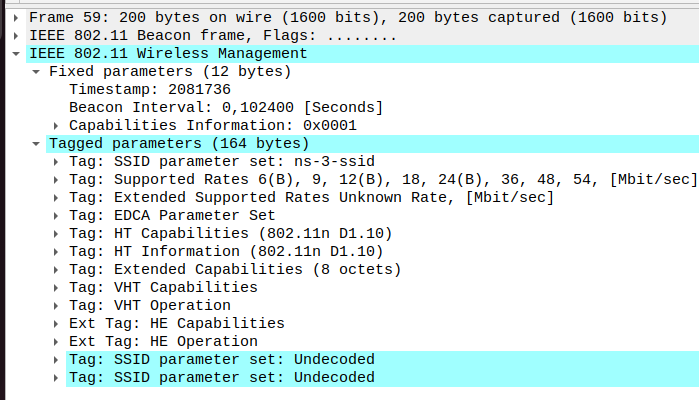

# Laboratory 5: Analysis of Wireshark Network Activity Traces

## 1. Network Setup and Key Simulation Events
The simulation setup consists of:
- **Point-to-Point (P2P)** connection between two nodes with specific data rate and delay attributes.
- **CSMA and Wi-Fi Networks** connected to various nodes.
- **UDP Echo Server and Client** configured to send and receive packets with defined intervals.

## 2. Analysis

### 2.1 Initial UDP Handshake and Packet Exchanges

The UDP Echo Client initiates communication with the Echo Server on port 9. This first packet confirms that the client is attempting to connect to the server, setting up the communication session.

- **Source IP**: `10.1.3.3` (UDP Echo Client)
- **Destination IP**: `10.1.2.4` (UDP Echo Server)
- **Source Port**: An ephemeral port (`49153`), dynamically assigned by the client
- **Destination Port**: Port `9`, specified in the server setup

This packet marks the start of data flow between the client and server, indicating that the network and applications are correctly configured to communicate.

```cpp
UdpEchoServerHelper echoServer(9);
ApplicationContainer serverApps = echoServer.Install(csmaNodes.Get(nCsma));
serverApps.Start(Seconds(1.0));
serverApps.Stop(Seconds(10.0));

UdpEchoClientHelper echoClient(csmaInterfaces.GetAddress(nCsma), 9);
echoClient.SetAttribute("MaxPackets", UintegerValue(10));
echoClient.SetAttribute("Interval", TimeValue(Seconds(1.0)));
echoClient.SetAttribute("PacketSize", UintegerValue(1024));
```
The screenshot below shows the initial UDP handshake packet between the client and server on port 9, demonstrating the start of the communication process.
  


### 2.2 Mobility Events, Position Updates, and 802.11 Management Frames

As nodes move within the network, their positions change periodically, affecting network connectivity and packet transmission. These movements are logged in the simulation and observed in Wireshark as fluctuations in packet timing and intervals. The mobile node (`10.1.3.3`) communicates with other nodes, and its movement introduces variation in packet intervals, reflecting connectivity challenges due to node mobility.

To maintain connectivity in a Wi-Fi environment, 802.11 management frames include for example:

- **Beacon Frames**: Broadcast periodically by the AP to announce the network SSID (`ns-3-ssid`). These frames allow the mobile node to detect when it is within the AP's range, enabling it to initiate a connection.
 

- **Association Requests and Responses**: When the mobile node detects the AP, it sends an association request to join the network. The AP responds with an association response, granting access. The presence of repeated association frames suggests that the mobile node frequently reconnects, likely due to movement in and out of the AP’s range.
- **Acknowledgment Frames**: These frames confirm the receipt of other frames, such as association requests, ensuring reliable communication between the AP and the mobile node.
- **Malformed Packets**: Some packets appear as malformed with the label "Unknown protocol version: 2." These could result from disruptions in connectivity or simulation artifacts, potentially caused by the mobile node’s movement, which may interfere with consistent packet construction.

This behavior illustrates the impact of mobility on connectivity, as the mobile node relies on these management frames to reconnect whenever it moves back into the network's coverage area.


This process enables the mobile node to maintain a connection to the Wi-Fi network even as it moves, though repeated association requests and responses may signal mobility-related disconnections.


### 2.2 Mobility Events, Position Updates, and 802.11 Management Frames

As nodes move within the network, their positions change periodically, affecting network connectivity and packet transmission. These movements are logged in the simulation and observed in Wireshark as fluctuations in packet timing and intervals. The mobile node (`10.1.3.3`) communicates with other nodes, and its movement introduces variation in packet intervals, reflecting connectivity challenges due to node mobility.

To maintain connectivity in a Wi-Fi environment, 802.11 management frames include:

- **Beacon Frames**
- **Association Requests and Responses**
- **Acknowledgment Frames**
- **Malformed Packets**

These frames illustrate the impact of mobility on connectivity, as the mobile node relies on them to reconnect whenever it moves back into the network's coverage area.

The screenshot below shows the captured 802.11 management frames, including beacon frames, association requests and responses, acknowledgment frames, and malformed packets.


#### Code Snippet
```cpp
mobility.SetPositionAllocator("ns3::GridPositionAllocator",
                              "MinX", DoubleValue(0.0),
                              "MinY", DoubleValue(0.0),
                              "DeltaX", DoubleValue(5.0),
                              "DeltaY", DoubleValue(10.0),
                              "GridWidth", UintegerValue(3),
                              "LayoutType", StringValue("RowFirst"));

mobility.SetMobilityModel("ns3::RandomWalk2dMobilityModel",
                          "Bounds", RectangleValue(Rectangle(-50, 50, -50, 50)));
mobility.Install(wifiStaNodes);
```

