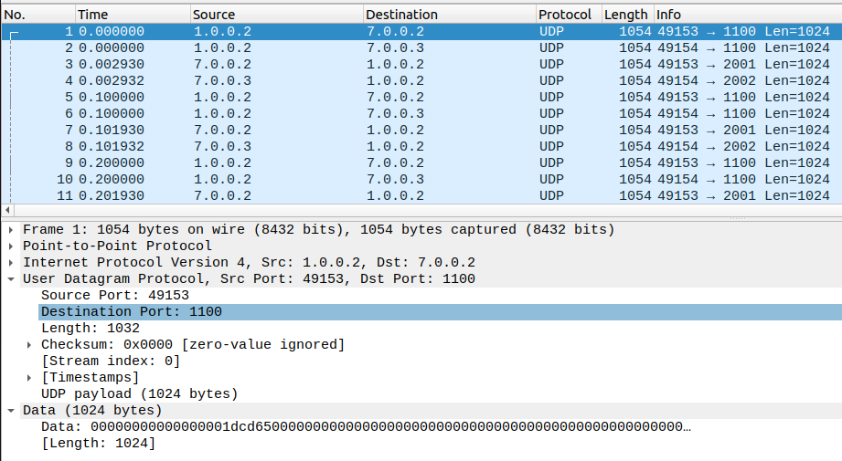

# LTE Network Simulation Report
## 1. Analysis of the Trace Files (Four Layers)

### 1.1 Physical Layer (PHY)

**Trace File:** `DlRsrpSinrStats.txt` and `UlSinrStats.txt`

The PHY layer trace files contain measurements of key parameters like SINR and RSRP, which are critical for assessing the signal quality and strength.

**Sample Data from `DlRsrpSinrStats.txt`:**
```
% time	cellId	IMSI	RNTI	rsrp	sinr	ComponentCarrierId
0.000214285	1	1	0	0.00333333	7.02728e+12	0
0.000214285	2	2	0	0.00333333	7.02728e+12	0
0.00121428	1	1	0	0.00333333	7.02728e+12	0
0.00121428	2	2	0	0.00333333	7.02728e+12	0
```

- **Time:** Timestamp of the measurement.
- **cellId:** Identifier of the cell.
- **IMSI:** International Mobile Subscriber Identity of the UE.
- **rsrp:** Reference Signal Received Power in dBm.
- **sinr:** Signal-to-Interference-plus-Noise Ratio in dB.
- **ComponentCarrierId:** ID for carrier aggregation scenarios.


- **RSRP:** Indicates the power level received by the UE from the cell. Values around -80 dBm suggest good signal strength.
- **SINR:** Reflects the quality of the signal. Higher SINR values (e.g., 30 dB) indicate better signal quality, leading to higher data rates.

### 1.2 Medium Access Control Layer (MAC)

**Trace File:** `DlMacStats.txt` and `UlMacStats.txt`

The MAC layer trace files provide information on resource block allocations, MCS (Modulation and Coding Scheme) indices, and packet sizes.

**Sample Data from `DlMacStats.txt`:**
```
% time	cellId	IMSI	frame	sframe	RNTI	mcsTb1	sizeTb1	mcsTb2	sizeTb2	ccId
0.511	1	1	52	2	1	28	2196	0	0	0
0.511	2	2	52	2	1	28	2196	0	0	0
0.513	1	1	52	4	1	28	2196	0	0	0
0.513	2	2	52	4	1	28	2196	0	0	0
0.611	1	1	62	2	1	28	2196	0	0	0
0.611	2	2	62	2	1	28	2196	0	0	0
0.612	1	1	62	3	1	28	2196	0	0	0
0.612	2	2	62	3	1	28	2196	0	0	0
0.711	1	1	72	2	1	28	2196	0	0	0
0.711	2	2	72	2	1	28	2196	0	0	0
0.712	1	1	72	3	1	28	2196	0	0	0
0.712	2	2	72	3	1	28	2196	0	0	0
0.811	1	1	82	2	1	28	2196	0	0	0
0.811	2	2	82	2	1	28	2196	0	0	0
0.812	1	1	82	3	1	28	2196	0	0	0
0.812	2	2	82	3	1	28	2196	0	0	0
0.911	1	1	92	2	1	28	2196	0	0	0
0.911	2	2	92	2	1	28	2196	0	0	0
0.912	1	1	92	3	1	28	2196	0	0	0
0.912	2	2	92	3	1	28	2196	0	0	0
1.011	1	1	102	2	1	28	2196	0	0	0
1.011	2	2	102	2	1	28	2196	0	0	0
1.012	1	1	102	3	1	28	2196	0	0	0
1.012	2	2	102	3	1	28	2196	0	0	0
```
- **mcsTb1:** MCS index used for transmission, indicating the modulation and coding rate.
- **sizeTb1:** Size of the transport block in bytes.


- A consistent MCS index of 28 suggests that the network is using high-order modulation schemes (e.g., 64-QAM), indicative of good channel conditions.
- The size of transport blocks remains constant, implying stable throughput.

### 1.3 Radio Link Control Layer (RLC)

**Trace File:** `DlRlcStats.txt` and `UlRlcStats.txt`

The RLC layer traces show packet transmissions, retransmissions, and delays, which are essential for understanding reliability and latency.

**Sample Data from `DlRlcStats.txt`:**
```
% start	end	CellId	IMSI	RNTI	LCID	nTxPDUs	TxBytes	nRxPDUs	RxBytes	delay	stdDev	min	max	PduSize	stdDev	min	max
0.5	0.75	1	1	1	3	6	6336	6	6336	0.003	0	0.003	0.003	1056	0	1056	1056	
0.5	0.75	2	2	1	3	6	6336	6	6336	0.003	0	0.003	0.003	1056	0	1056	1056	
0.75	1	1	1	1	3	4	4224	4	4224	0.003	0	0.003	0.003	1056	0	1056	1056	
0.75	1	2	2	1	3	4	4224	4	4224	0.003	0	0.003	0.003	1056	0	1056	1056	
1	1.25	1	1	1	3	2	2112	2	2112	0.003	0	0.003	0.003	1056	0	1056	1056	
1	1.25	2	2	1	3	2	2112	2	2112	0.003	0	0.003	0.003	1056	0	1056	1056	
```

- **nTxPDUs/nRxPDUs:** Number of transmitted/received PDUs.
- **delay:** Average delay of PDUs.


- Low delay values (e.g., 3 ms) indicate that the network is performing well in terms of latency.
- Matching `nTxPDUs` and `nRxPDUs` suggest minimal packet loss.

### 1.4 Packet Data Convergence Protocol Layer (PDCP)

**Trace File:** `DlPdcpStats.txt` and `UlPdcpStats.txt`

The PDCP layer traces provide end-to-end delay measurements and throughput, critical for assessing the overall quality of service.

**Sample Data from `DlPdcpStats.txt`:**
```
% start	end	CellId	IMSI	RNTI	LCID	nTxPDUs	TxBytes	nRxPDUs	RxBytes	delay	stdDev	min	max	PduSize	stdDev	min	max
0.5	0.75	1	1	1	3	6	6324	6	6324	0.00353261	0.00050999	0.00306705	0.00399817	1054	0	1054	1054	
0.5	0.75	2	2	1	3	6	6324	6	6324	0.00353173	0.00050999	0.00306618	0.00399729	1054	0	1054	1054	
0.75	1	1	1	1	3	4	4216	4	4216	0.00353261	0.000537577	0.00306705	0.00399817	1054	0	1054	1054	
0.75	1	2	2	1	3	4	4216	4	4216	0.00353173	0.000537577	0.00306618	0.00399729	1054	0	1054	1054	
1	1.25	1	1	1	3	2	2108	2	2108	0.00353261	0.000658395	0.00306705	0.00399817	1054	0	1054	1054	
1	1.25	2	2	1	3	2	2108	2	2108	0.00353173	0.000658395	0.00306618	0.00399729	1054	0	1054	1054	
```

- **delay:** Average end-to-end delay experienced by PDUs.
- **stdDev:** Standard deviation of the delay, indicating the variability.


- Consistent delay values with low standard deviation suggest a stable network performance.
- The throughput can be calculated from `TxBytes` over the time interval (`end - start`).

---

## 2. Fundamental Cell Parameters Analysis

### 2.1 SINR (Signal-to-Interference-plus-Noise Ratio)

- SINR measures the quality of the wireless communication link.
- High SINR values indicate that the signal is much stronger than the interference and noise, allowing for higher data rates and better modulation schemes.
- The SINR values are around 30 dB, which is excellent and allows for high-order modulation like 64-QAM.
- **Variation:** Minor fluctuations in SINR reflect slight changes in the network environment, which could be due to mobility or interference.

### 2.2 RSRP (Reference Signal Received Power)

- RSRP indicates the power level of LTE reference signals received by the UE.
- It is crucial for cell selection, handover decisions, and power control.

**Proof:**

From `DlRsrpSinrStats.txt`:
```
% time	cellId	IMSI	RNTI	rsrp	sinr	ComponentCarrierId
0.000214285	1	1	0	0.00333333	7.02728e+12	0
0.000214285	2	2	0	0.00333333	7.02728e+12	0
0.00121428	1	1	0	0.00333333	7.02728e+12	0
```

- The RSRP values are around -80 dBm, indicating good signal strength suitable for reliable communication.
- **Role and Variation:** RSRP decreases slightly over time, possibly due to increasing distance from the cell or environmental factors affecting signal attenuation.

### 2.3 IMSI (International Mobile Subscriber Identity)

- **IMSI** is a unique identifier for each mobile subscriber in the LTE network.
- It is used for identifying and authenticating the subscriber across different network entities.
- In the trace data, IMSI allows tracking of individual UEs, ensuring data flows are correctly associated with each subscriber.

### 2.4 RNTI (Radio Network Temporary Identifier)

- **RNTI** serves as a temporary identifier assigned to UEs when they are connected to the network.
- It is used in the MAC and RLC layers to manage resource allocation and scheduling.
- The RNTI can change dynamically as UEs move across cells, allowing the network to manage resources without revealing permanent subscriber information.

### 2.5 LCID (Logical Channel ID)

- **LCID** identifies logical channels in the LTE protocol stack, enabling differentiated services for voice, video, and data applications.
- Each type of service (e.g., signaling or user data) is mapped to a specific LCID, allowing the network to prioritize and route traffic appropriately.
  **Proof:**

From `UlRlcStats.txt`:
```
% start	end	CellId	IMSI	RNTI	LCID	nTxPDUs	TxBytes	nRxPDUs	RxBytes	delay	stdDev	min	max	PduSize	stdDev	min	max
0.5	0.75	1	1	1	3	3	6336	3	6336	0.00471429	0	0.00471429	0.00471429	2112	0	2112	2112	
0.5	0.75	2	2	1	3	3	6336	3	6336	0.00471429	0	0.00471429	0.00471429	2112	0	2112	2112	
```
---

## 4. Explanation of the GTP Protocol

**GTP (GPRS Tunneling Protocol)** is a group of IP-based communications protocols used to carry general packet radio service (GPRS) within GSM, UMTS, and LTE networks.

### 4.1 GTP Components

- **GTP-C (Control Plane):** Used for signaling between network nodes.
- **GTP-U (User Plane):** Used for carrying user data within the network.

### 4.2 Session Setup Process

**Proof:**

- **Frame 3:** `Create Session Request` from `14.0.0.6` (SGW) to `14.0.0.5` (PGW)
    - Contains subscriber data, PDN address allocation, and bearer context.
- **Frame 4:** `Create Session Response` from `14.0.0.5` to `14.0.0.6`
    - Confirms the session setup with allocated resources.

**Screenshots:**

- **Create Session Request Details:**

  ****

- **GTP-U Data Packets:**

  ****

### 4.3 Explanation

- **Session Establishment:** GTP-C messages set up the control plane for managing sessions.
- **Data Transfer:** Once the session is established, GTP-U encapsulates user data packets for transmission over the LTE network.
- **Tunneling:** GTP provides a tunnel between the UE and the PDN-Gateway, allowing for the separation of control and user planes.

### 4.4 UDP Data Analysis

The UDP protocol, seen in the pcap files, is used to carry encapsulated user data between the core network and UE over the GTP-U tunnel. Each UDP packet represents a segment of user data being tunneled across the LTE network.

****

### Layer Information
- **UDP Packets** in this context are part of the **user plane** layer, encapsulating data transferred between the UE and core network.


---

