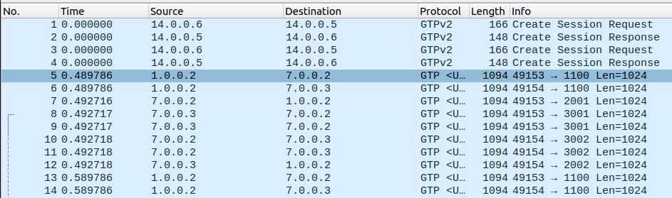

# GTPv2 Session Creation

In LTE networks, **GTPv2 (GPRS Tunneling Protocol version 2)** is used to manage sessions between the User Equipment (UE) and core network components. GTPv2 handles control messages required to create, modify, and delete sessions.

The session setup process begins with a **Create Session Request** from the core network, followed by a **Create Session Response**. Once the session is established, data packets are sent using GTP-U (GTP - User Plane) encapsulation.

The first few frames show the session creation exchange:
- **Frame 3**: A **Create Session Request** from `14.0.0.6` to `14.0.0.5`, which includes key identifiers and configuration details.
- **Frame 4**: The corresponding **Create Session Response**, confirming session establishment.

After these initial setup frames, we can see numerous GTP-U packets are visible, representing the actual user data being tunneled over the session. These packets carry payloads, such as application data, and use different port numbers (e.g., `49153 → 2001`) to indicate separate data flows and potential QoS (Quality of Service) distinctions.

****

Closer look at the **Create Session Request** message (Frame 3), with fields such as:
- **IMSI (International Mobile Subscriber Identity)**: A unique identifier for the user, allowing the network to authenticate and track the subscriber.
- **User Location Info (ULI)**: Provides information on the UE’s location, helping the network manage resources and route traffic effectively.
- **F-TEID (Fully Qualified Tunnel Endpoint Identifier)**: Specifies the tunnel endpoint for data transfer, including the Serving Gateway (SGW) IP and TEID.

These fields are used for setting up the GTP tunnel that will carry user data between the UE and core network.

****

Through this session setup, GTPv2 enables a dedicated and secure pathway for data, allowing LTE networks to deliver reliable communication services.
