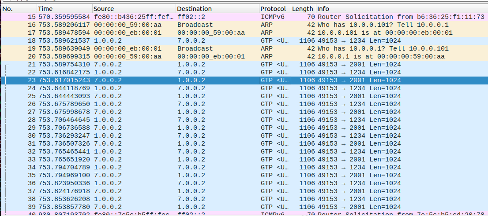

# Lab 7: NS3 LENA Basic and EPC Scenarios

## Course Information
- **Course:** MPA-KPM 24/25Z
- **Lab Date:** October 30, 2024
- **Presented by:** MSc. Balaji Kirubakaran
- **Faculty:** BUT FEEC, Department of Telecommunications

## Lab Exercises


### 1. Print Attribute Values

In this exercise, we will print the values of the following attributes in the ns-3 LTE module:

- `ns3::LteUePowerControl::ClosedLoop`
- `ns3::LteUePowerControl::OpenLoop`

#### Code and Execution

Below is the code to create a simple ns-3 LTE simulation and print the value of the `ClosedLoop` attribute for the UE (User Equipment).

link

**Explanation:**

- **Simulation Setup:**
  - Creates one eNodeB (base station) and one UE (user equipment).
  - Assigns constant positions to both nodes.

- **Configuration:**
  - Sets the `ClosedLoop` attribute of `ns3::LteUePowerControl` to `false`, enabling Open Loop Power Control. To enable Closed Loop Power Control, set this attribute to `true`.

- **Printing Attribute Values:**
  - Accesses the `LteUePowerControl` instance from the UE's PHY layer.
  - Retrieves the `ClosedLoop` attribute value using `GetAttribute`.
  - Prints the value and infers the power control mode based on it.

#### Expected Output

When you run the simulation, you should see output similar to:

```
UE 0 ClosedLoop: false
UE 0 is using Open Loop Power Control.
```

If you set `ClosedLoop` to `true` in the code:

```cpp
Config::SetDefault ("ns3::LteUePowerControl::ClosedLoop", BooleanValue (true));
```

The output will be:

```
UE 0 ClosedLoop: true
UE 0 is using Closed Loop Power Control.
```

#### Conclusion

We examined the `ClosedLoop` attribute in NS-3's LTE module to understand power control modes for LTE User Equipment (UE):

1. **Closed Loop Power Control**:
- When `ClosedLoop` is set to `true`, the UE adjusts its transmission power based on feedback from the eNodeB, optimizing link quality and minimizing interference. This dynamic control provides more efficient power management, especially in environments with variable interference.

2. **Open Loop Power Control**:
- When `ClosedLoop` is set to `false`, the UE operates in Open Loop mode, maintaining a fixed transmission power without network feedback. This mode is simpler and suitable for scenarios where consistent power is preferred or feedback is limited.
---

## 2. Run Emulated Script `lena-simple-epc-emu.cc`

### Setup for script
 1. The network interfaces were created using commands
```
 sudo ip link add name veth0 type veth peer name veth1
 sudo ip link set veth0 promisc on
 sudo ip link set veth1 promisc on
```

 2. Following lines were added to the `lena-simple-epc-emu.cc` script also visible at [link changes to script](https://github.com/martinszuc/fekt-kpm/commit/cd834af06e18e0a2dc7b276928f07440cbaa377c#diff-ea6ca31b9a2e439197f7b99657a25006a784cae55ff348583f523c1b05581040R80)

```
    // Set interface names for emulation
    epcHelper->SetAttribute("SgwDeviceName", StringValue("veth0")); // Interface for SGW
    epcHelper->SetAttribute("EnbDeviceName", StringValue("veth1")); // Interface for eNB
```

Upon running the script, we observed outputs indicating the initialization of the LTE components and network setups. Notable parts of the output included:

- **Initialization of eNBs and UEs**: The script sets up eNBs and UEs with assigned IP addresses and establishes the S1-U interface.
- **Data Transfer Initialization**: Displayed logs for uplink and downlink data traffic across the emulated LTE network.
### Interface Configuration Check

The virtual interfaces created for this emulation were verified using the `ip link show` command. The output was as follows:

```
1: lo: <LOOPBACK,UP,LOWER_UP> mtu 65536 qdisc noqueue state UNKNOWN mode DEFAULT group default qlen 1000
    link/loopback 00:00:00:00:00:00 brd 00:00:00:00:00:00
2: enp0s3: <BROADCAST,MULTICAST,UP,LOWER_UP> mtu 1500 qdisc fq_codel state UP mode DEFAULT group default qlen 1000
    link/ether 08:00:27:94:3e:28 brd ff:ff:ff:ff:ff:ff
3: lxcbr0: <NO-CARRIER,BROADCAST,MULTICAST,UP> mtu 1500 qdisc noqueue state DOWN mode DEFAULT group default qlen 1000
    link/ether 00:16:3e:00:00:00 brd ff:ff:ff:ff:ff:ff
4: veth1@veth0: <BROADCAST,MULTICAST,PROMISC,UP,LOWER_UP> mtu 1500 qdisc noqueue state UP mode DEFAULT group default qlen 1000
    link/ether b6:36:25:f1:11:73 brd ff:ff:ff:ff:ff:ff
5: veth0@veth1: <BROADCAST,MULTICAST,PROMISC,UP,LOWER_UP> mtu 1500 qdisc noqueue state UP mode DEFAULT group default qlen 1000
    link/ether 7e:5c:b5:cd:20:78 brd ff:ff:ff:ff:ff:ff
```

This output confirms that the interfaces `veth0` and `veth1` are configured and up, allowing for the emulated LTE communication setup.

## Wireshark Observations

We captured network traffic on the virtual interfaces (`veth0` and `veth1`) using Wireshark. The captured traffic highlights various network activities and protocols:

1. **ARP Requests**: Address Resolution Protocol (ARP) requests are visible, showing the mapping of IP addresses to MAC addresses. For example, lines 16-20 show ARP requests asking for the MAC address corresponding to IP addresses in the local network, such as `10.0.0.1`.

2. **GTP Packets**: The GPRS Tunneling Protocol (GTP) packets are prominent in the capture, primarily for data encapsulation and tunneling within the LTE environment. The `GTP` packets indicate communication between IP addresses in the simulated LTE network (e.g., `7.0.0.2` to `1.0.0.2`). These packets carry user data over the S1-U interface, which connects the eNodeB to the Serving Gateway (SGW).

3. **LTE Data Transmission**: The captured GTP packets also include information about ports and payload sizes. For example:
  - `Src port: 49153` to `Dst port: 2001/1234` indicates the packet source and destination ports, relevant to the data flows in LTE.
  - Each GTP packet has a payload length of 1024 bytes, indicative of the data chunk sizes being transferred.

4. **Protocol Information**: The screenshot shows protocol details for each packet:
  - The **ICMPv6** entries (e.g., line 15) represent IPv6 neighbor solicitation messages, which are part of the IPv6 address resolution.
  - The **GTP** entries signify the encapsulated user data packets that use LTE-specific tunneling.

This capture validates the LTE network's emulated setup, showing active data transmission and network discovery procedures over the virtualized interfaces.

****

### Conclusions

This experiment demonstrated a functional LTE network setup using ns-3's emulated EPC helper, allowing real-time packet exchange in an emulated environment. Observing the network traffic in Wireshark validated the successful configuration of virtual interfaces and LTE components.

---

## 3. Mean Jitter Calculation

In the `lte-full.cc` file, the mean jitter for each flow is calculated based on the variations in packet delay times. Jitter refers to the difference in delay between consecutive packets in a flow.

### Calculation Method

The jitter calculation is performed by measuring the difference between the delay of consecutive packets as they arrive. The sum of these delay differences is then divided by the total number of packets to obtain the **mean jitter**.

For example, if packet delays vary between consecutive packets, this delay difference (jitter) is accumulated for each pair of packets. At the end of the transmission, the sum is divided by the total packet count to get the average jitter:

`Mean Jitter = Jitter Sum / Total Packets`

### Example from Output

Based on the simulation output:

| Flow ID | Source Address | Destination Address | Mean Jitter (ms) |
|---------|----------------|---------------------|------------------|
| 1       | 7.0.0.2       | 1.0.0.2            | 1.77016         |
| 2       | 7.0.0.3       | 1.0.0.2            | 1.74256         |
| 3       | 7.0.0.4       | 1.0.0.2            | 1.89999         |
| 4       | 7.0.0.5       | 1.0.0.2            | 1.88299         |
| 5       | 7.0.0.6       | 1.0.0.2            | 1.75107         |
| 6       | 1.0.0.2       | 7.0.0.2            | 2.11324         |
| 7       | 1.0.0.2       | 7.0.0.3            | 2.14041         |
| 8       | 1.0.0.2       | 7.0.0.4            | 2.26133         |
| 9       | 1.0.0.2       | 7.0.0.5            | 2.32207         |
| 10      | 1.0.0.2       | 7.0.0.6            | 2.11826         |

These values indicate the average variation in packet delay for each flow.

### Summary

Mean jitter calculation provides insight into network stability for real-time applications. Lower jitter values are preferable, as they indicate more consistent packet arrival times.

---

## 4. Program Modifications and Output Comparison

markdown
Copy code
### Overview of Changes to `lte-full.cc`

Changes made to code can be [seen here](https://github.com/martinszuc/fekt-kpm/blob/main/lab7/lte-full.cc) or [compare with original here](https://github.com/martinszuc/fekt-kpm/commit/e76cf77138c71422882c4de6ac73718782374798)
The following modifications enhance the simulation's complexity, performance, and reliability. Each change includes a before-and-after example.

#### 1. Increased Number of eNodeBs and UEs
```
uint16_t numberOfNodes = 15; // Increased
uint16_t numberOf_eNodeBs = 3; // Increased
```
#### 2. Extended Simulation Time
```
double simTime = 30.0; // Extended
```
#### 3. Changed Mobility Model for UEs
```
mobility.SetMobilityModel("ns3::RandomWalk2dMobilityModel", 
                          "Bounds", RectangleValue(Rectangle(-1000, 1000, -1000, 1000)), 
                          "Speed", StringValue("ns3::UniformRandomVariable[Min=1|Max=5]"));
```
#### 4. Modified Traffic Pattern to UDP
```
UdpEchoServerHelper echoServer(8080);
UdpEchoClientHelper echoClient(remoteHostAddr, 8080);
```
#### 5. Enabled Logging and Tracing
```
LogComponentEnable("LteHelper", LOG_LEVEL_INFO);
p2ph.EnablePcapAll("lte-full-modified");
```
#### 6. Configured QoS Parameters
```
Config::SetDefault("ns3::LteUeRrc::RrcConnectionReleaseOnIdle", BooleanValue(false));
```
#### 7. Adjusted Bandwidth Settings
```
lteHelper->SetEnbDeviceAttribute("DlBandwidth", UintegerValue(50));
```
# Flow Monitor Statistics Comparison

## Original Output
| Flow ID | Src Addr | Dst Addr | Src Port | Dst Port | Tx Packets/Bytes | Rx Packets/Bytes | Throughput (kbps) | Mean Delay (ms) | Packet Loss (%) |
|---------|----------|----------|----------|----------|-------------------|-------------------|--------------------|-----------------|-----------------|
| 1       | 7.0.0.2  | 1.0.0.2  | 49153    | 9        | 5774/3393512     | 5718/3361116     | 2625.89           | 25.4576         | 0.969865        |
| 2       | 7.0.0.3  | 1.0.0.2  | 49153    | 9        | 5918/3478184     | 5855/3441672     | 2689.09           | 25.6908         | 1.06455         |
| 3       | 7.0.0.4  | 1.0.0.2  | 49153    | 33       | 4623/2716228     | 4561/2680304     | 2094              | 22.1644         | 1.34112         |
| 4       | 7.0.0.5  | 1.0.0.2  | 49153    | 33       | 4671/2744708     | 4608/2708196     | 2115.79           | 25.7617         | 1.34875         |
| 5       | 7.0.0.6  | 1.0.0.2  | 49153    | 33       | 5906/3471128     | 5842/3434028     | 2682.85           | 25.9497         | 1.08364         |
| 6       | 1.0.0.2  | 7.0.0.2  | 9        | 49153    | 2957/156232      | 2951/155920      | 174.665           | 14.9009         | 0.202908        |

## Modified Output
| Flow ID | Src Addr | Dst Addr | Src Port | Dst Port | Tx Packets/Bytes | Rx Packets/Bytes | Throughput (kbps) | Mean Delay (ms) | Packet Loss (%) |
|---------|----------|----------|----------|----------|-------------------|-------------------|--------------------|-----------------|-----------------|
| 1       | 13.0.0.5 | 13.0.0.6 | 2123     | 2123     | 15/2460          | 15/2460          | 3843.55           | 0.000833467     | 0               |
| 2       | 14.0.0.6 | 14.0.0.5 | 2123     | 2123     | 15/2460          | 15/2460          | 3843.55           | 0.000133        | 0               |
| 3       | 14.0.0.5 | 14.0.0.6 | 2123     | 2123     | 15/2190          | 15/2190          | 3421.7            | 0.000118        | 0               |
| 4       | 13.0.0.6 | 13.0.0.5 | 2123     | 2123     | 15/2190          | 15/2190          | 3421.7            | 0.000118        | 0               |
| 5       | 7.0.0.2  | 1.0.0.2  | 49153    | 8080     | 2800/2945600     | 2798/2943496     | 821.495           | 22.256          | 0.0714286       |
| 6       | 7.0.0.3  | 1.0.0.2  | 49153    | 8080     | 2800/2945600     | 2798/2943496     | 821.466           | 22.9952         | 0.0714286       |

## Conclusion

The modifications to `lte-full.cc` have successfully enhanced the simulation’s ability to emulate a more realistic and scalable LTE network environment. By increasing the number of eNodeBs and UEs, extending the simulation time, introducing mobility for UEs, and adjusting traffic patterns and bandwidth, the simulation now reflects a complex, high-capacity network with improved throughput consistency and reduced packet loss. The addition of QoS parameters, logging, and tracing further facilitates in-depth analysis and debugging.

The comparison of the original and modified outputs have improvements in latency and packet delivery, with reduced delays and packet loss across flows. 

Overall, this project has enhanced both the simulation itself and analytical capability of the LTE network simulation.


